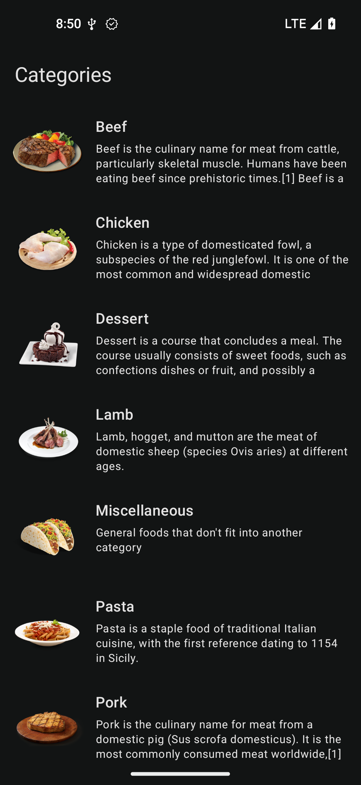
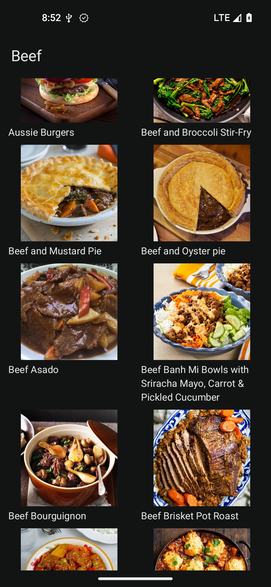
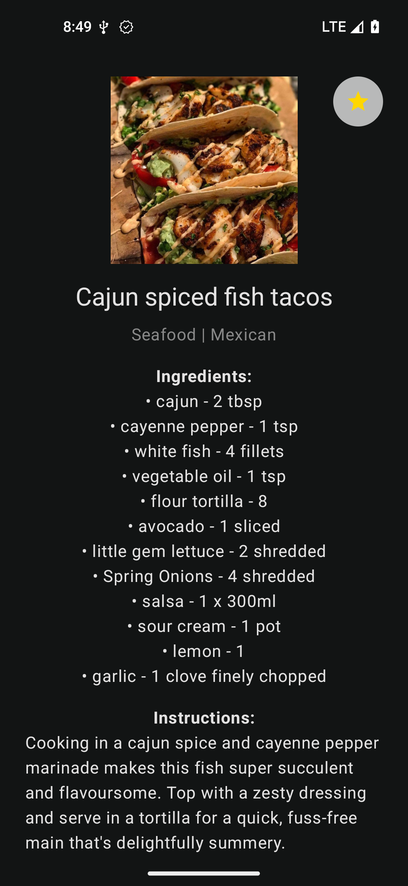
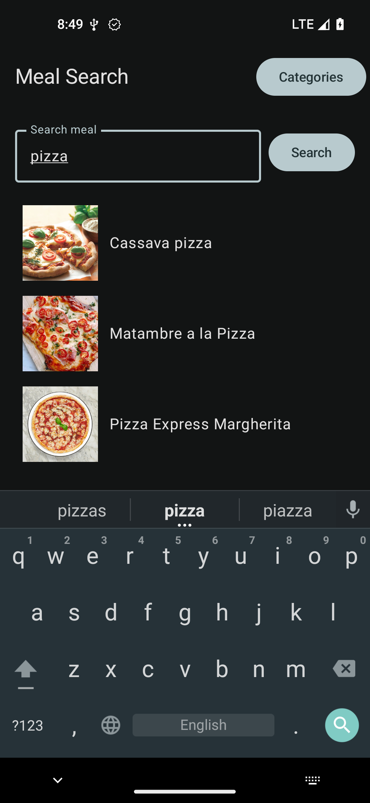
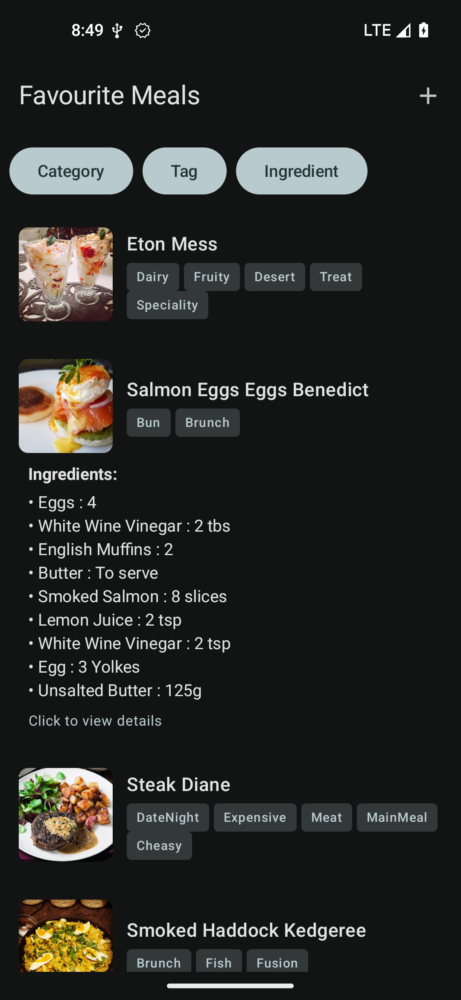

# 🍽️ MyMeals

Android app for browsing and saving your favourite meals using [TheMealDB](https://www.themealdb.com/).

---

## ✨ Features

* 📂 Browse meal categories
* 🍛 View meals in each category
* 🔍 Search for meals
* ❤️ Save favourite meals
* 📖 View detailed meal information

---

## 📸 Screenshots

| Categories                     | Meals                        | Meal Details                  |
|--------------------------------|------------------------------|-------------------------------|
|  |  |  |

| Search                     | Favourites                          |
|----------------------------|-------------------------------------|
|  |  |

---

## 🚀 Running

Open the project in **Android Studio** and run on an emulator or device.
